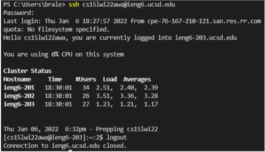
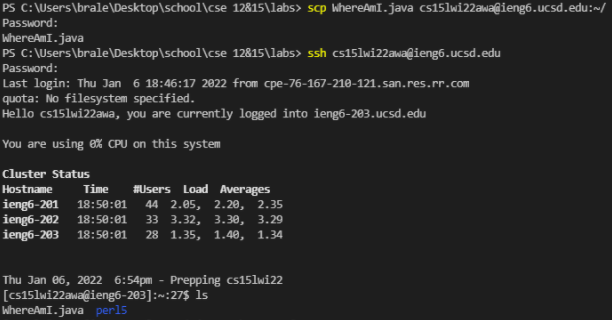
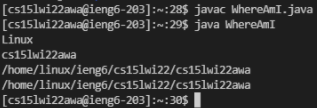
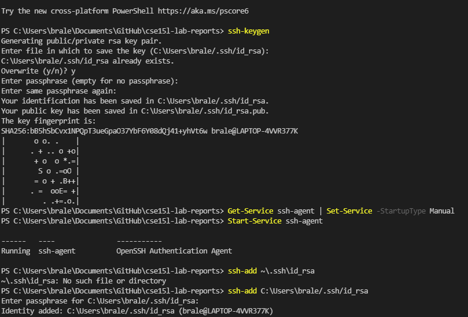
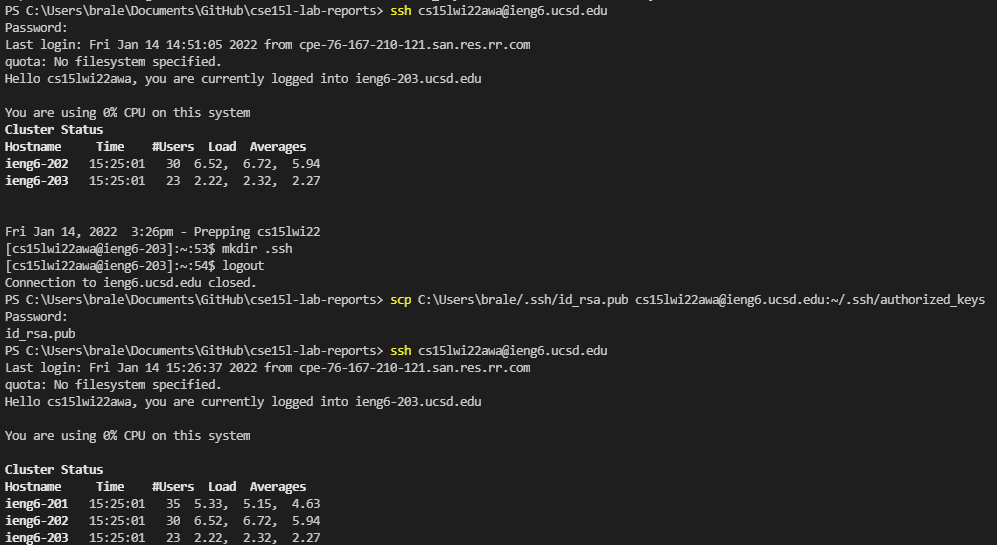
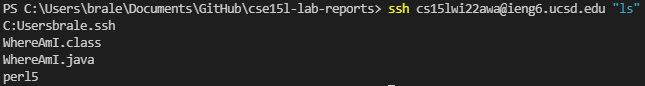

# Lab Report 1: How to log into `ieng6`
## 1. Install [Visual Studio Code](https://code.visualstudio.com/Download)

Download and install VSCode from its website by downloading an installer for your OS and then opening said installer from your downloads folder.

## 2. Remotely connecting
1. Open VSCode, open whatever project you want to play with, and then open a new terminal.
2. In this terminal, type `ssh` followe dby your ieng6 username (like `cse15lwi22XXX@ieng6.ucsd.edu`) 
 
3. Once you have successfully logged in, type `logout` to log yourself out.

## 3. Trying some commands
Try typing some of these commands into the terminal while you are logged into SSH
* `cd ~`
* `cd`
* `ls -lat`
* `ls -a`
* `pwd`
* `mkdir` 
The results will look a lot like this:

## 4. Moving files with SCP
If you are trying to move a file from your computer into the server, use the `scp` command. 
Example: `scp <filename>.java cs15lwi22XXX@ieng6.ucsd.edu:~/` 
Successful results should look something like this: 
 
You can also now run `java` and `javac` commands from inside the server: 

## 5. Getting an SSH key
Follow these commands to make a key so you can log in without a passcode: 

## 6. Working even faster
Once you have the SSH key, you can type commands with after your login command in order to have an even faster and more efficient workflow: 
