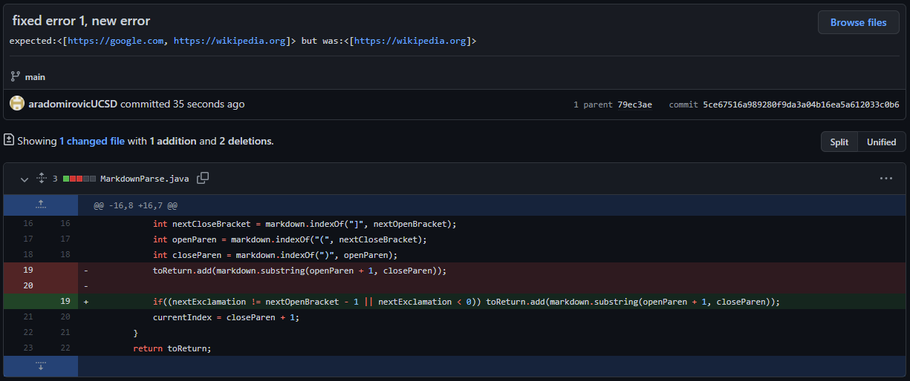
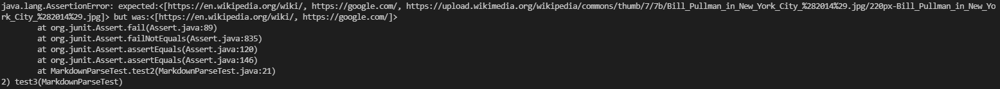
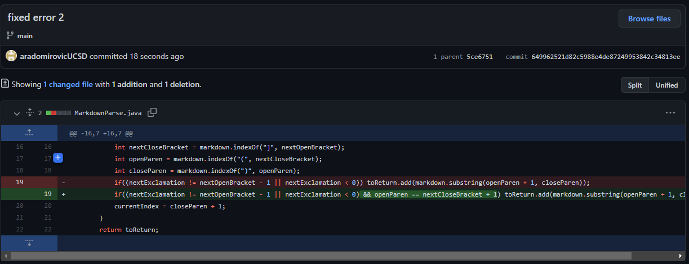
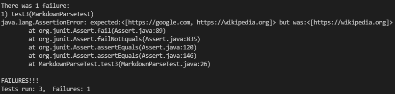
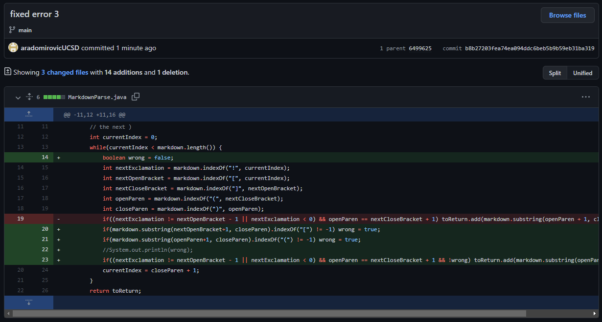
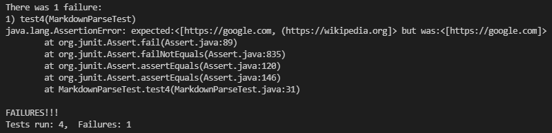

# Lab Report 2: JUnit Testing
## 1. 
Input: 
 
Output: 
 
Here was the original error in my code. The getLinks() method would return not just links, but pretty much any text that was in between two parentheses which followed a pair of brackets. I fixed this by checking if there are exclamations ahead of the brackets. 
[Link to JUnit Test file](https://github.com/aradomirovicUCSD/markdown-parse/commit/0539a25147ff4243aa183070b9a8798f2a09c1ff#diff-c4d343f38cf62ed2fa12aa0d52021ed9da6fca82b64a80fec22a750f40e114b1) 
## 2. 
Input: 
 
Output: 
 
Here I hadn't accounted for the fact that someone could put a massive number of spaces in between the bracket and parentheses, not expecting it to form a link. I fixed this by making sure that there were no spaces in between the closing bracket and the opening parentheses. 
[Link to JUnit Test file](https://github.com/aradomirovicUCSD/markdown-parse/commit/0539a25147ff4243aa183070b9a8798f2a09c1ff#diff-c4d343f38cf62ed2fa12aa0d52021ed9da6fca82b64a80fec22a750f40e114b1) 
## 3. 
Input: 
 
Output: 
 
Here I hadn't accounted for the fact that a normal MD file would have an error reading a link if too many opening parentheses or opening/closing brackets were typed. So I fixed that by checking if there were any opening parentheses following the first one, and did the same with brackets. 
[Link to JUnit Test file](https://github.com/aradomirovicUCSD/markdown-parse/blob/main/MarkdownParseTest.java)