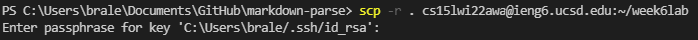
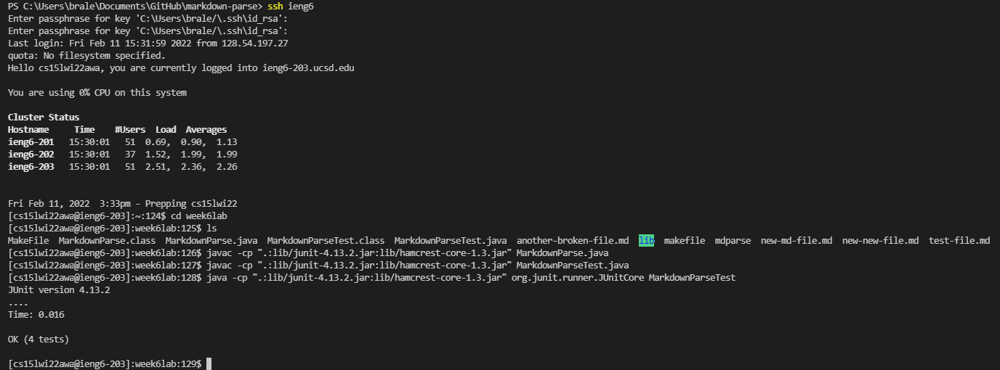
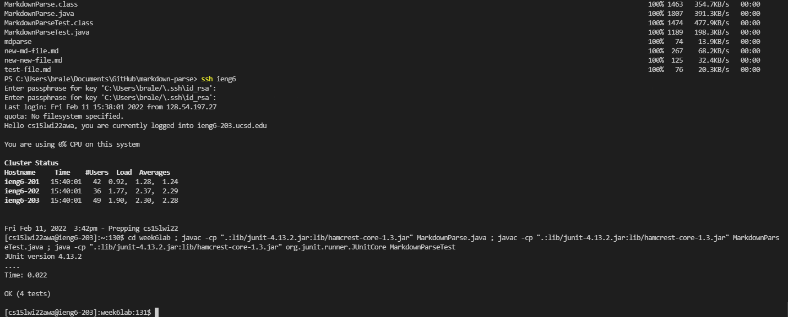

# COPYING AND RUNNING WHOLE DIRECTORIES WITH SCP

## 1. Copying using SCP
 
## 1. Running using ssh
 
## 1. Optimising the time it takes to do both
<i>Windows has a problem with running SCP and following commands in tandem, so I could only show those commands being run consecutively in ssh:</i>
 