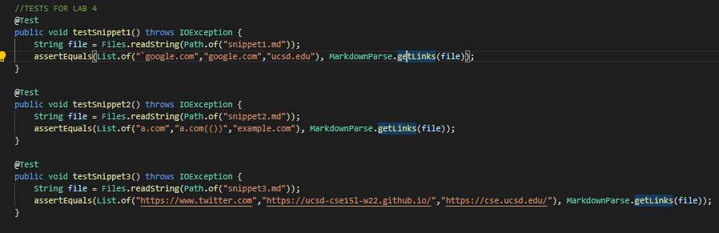
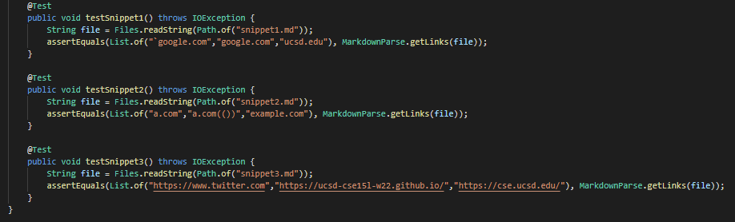
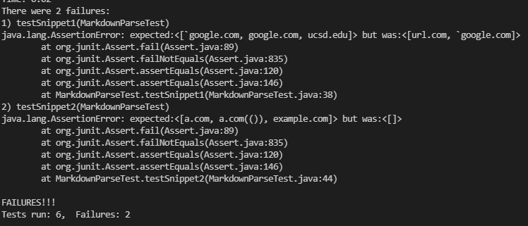
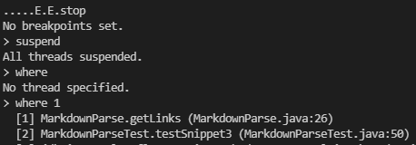

## Tests
They look fairly identical, since I just created MD files from which to test.

## Errors in tests

 
The last test formed an infinite loop. 

## Questions
1. We could introduce 2-3 lines of code that would treat backticks, if present, as the borders of a string; nothing within those backticks would affect the generation of a link.

2. This could not be a simply solved program as it would need a lot of workarounds to deal with bad syntax such as nested links in order to present the same output as a typical MD parser. Since this MD parser relies solely on the locations of '[]' and '()' to define what is a valid link and what isn't, it would take more than 10 lines of code to fix problems such as this.

3. At the beginning of the getLinks() method, we could remove all newline characters from the string. This can be as little as one line of code and would solve the problem with snippet 3.