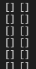
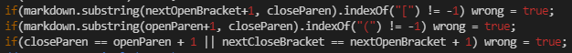
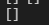
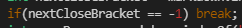
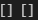

# Lab Report 5

To find the differences, I wrote a for loop to test both my implementation and the instructiors' implementations and printing side-by-side, and then comparing the results like this: 

1. The first error I had run into was that an infinite loop would immediately trigger after any parentheses or brackets were badly ordered (parentheses came after brackets, or if there were two pairs of either). My code was wrong, since infinite loops are not ever wanted in a program such as a markdown parser, but I eventually found three solutions that fixed these issues; i had created a boolean variable called 'wrong' that would track all the possible ways this syntax could be incorrect, and compiled three lines of code that would trigger wrong to be true if the syntax was out of order. 
 
This solution caused a few of the multi-line test cases to produce a wrong output (as the program would terminate, so I switched from triggering the while loop to break when wrong was true to setting currentIndex to the next newLine character). This alleviated the problems with the infinite loops.

2. The second error I ran into was an infinite loop that would occur after the instructors' MarkdownParse implementation had run on one test case. Naturally this meant that my implementation was incorrect. 
 
I proceeded to learn that this file had no closing bracket (I had written a line to handle absentee closing parentheses, but closing brackets still went unpoliced). I fixed this by implementing a line that would break the loop if no closing bracket was present: 
 
The infinite loop then ceased: 
